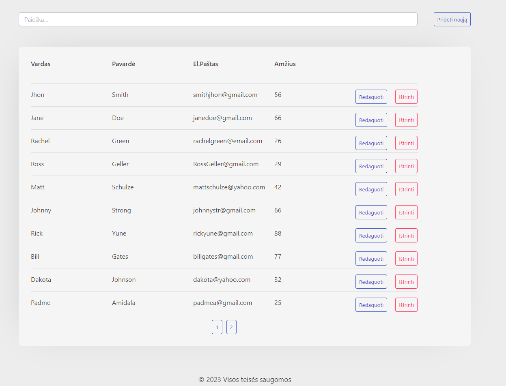
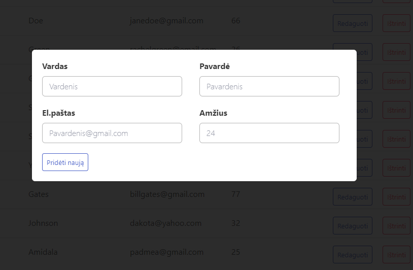
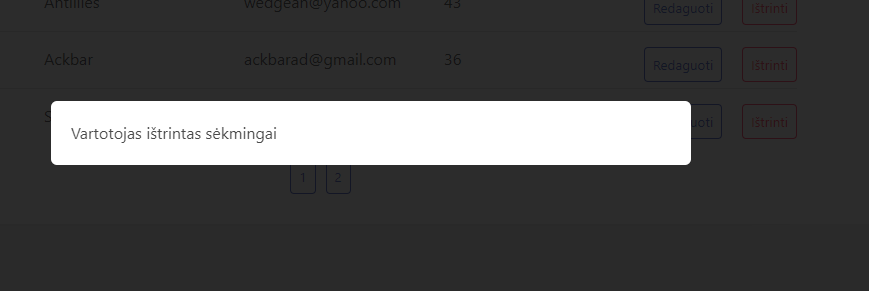
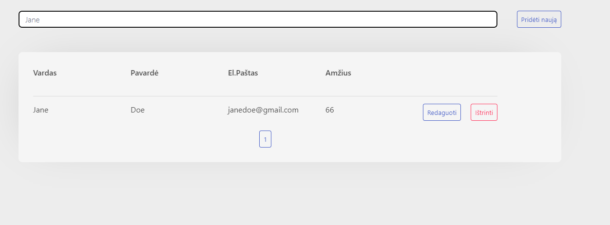
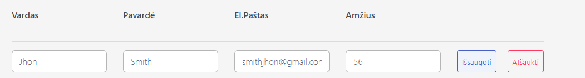
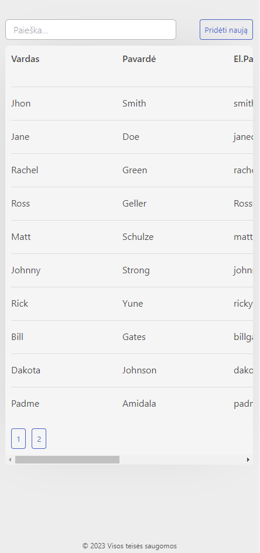
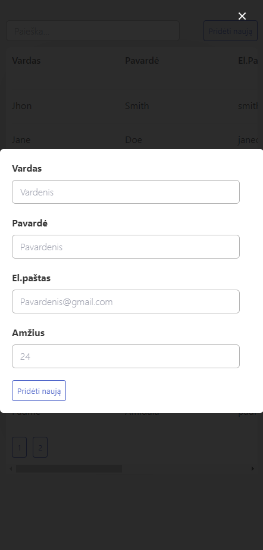

<h1> CRUD app </h1>
  

 With this app you can add, delete, update, search users. UX figma design https://www.figma.com/file/gZ63MOLEMwaiRviZnyM9ZM/Baigiamasis-projektas?type=design&node-id=207-2&mode=design&t=uirTFQ7KMFXGv7cs-4.

 

<h2> How to start frontend and backend servers?

 

<h2>Client
<h3>How to start frontend server?</h3>

- Open terminal in VSCode
- Write command `cd client/vite-crud-project`
- Install node_modules `npm ci`
- Run server `npm run dev`

 

<h2>Server
<h3>How to start backend server?</h3>

- Open terminal in VSCode
- Write command `cd server`
- Install node_modules `npm ci`
- Run server `npm run dev`
- Don't forget to add .env file
- Split the terminal and add command `npx tsc --watch`

<h2> Used tools:
  
- React 
- TypeScript
- Node.js
- Atomic design
- Responsive Web Design Media Quries

 

<h2> Overview

<h3> Desktop

<h3> Mobile

